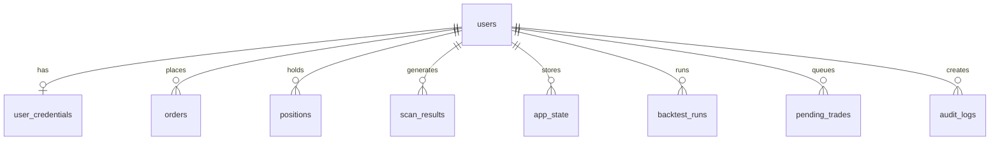

# Database Schema

SQLAlchemy models defined in `schwab_skill/webapp/models.py`. Used by both the local dashboard (SQLite) and SaaS API (Postgres).

## Entity Relationship

## Tables

### users
Primary user record.

| Column | Type | Notes |
|--------|------|-------|
| id | String(128) | PK |
| email | String(255) | nullable, indexed |
| auth_provider | String(32) | default "supabase" |
| stripe_customer_id | String(64) | nullable, indexed |
| stripe_subscription_id | String(64) | nullable |
| subscription_status | String(32) | nullable |
| subscription_current_period_end | DateTime | nullable |
| live_execution_enabled | Boolean | default false |
| trading_halted | Boolean | default false |
| created_at, updated_at | DateTime(tz) | auto-managed |

### user_credentials
Encrypted Schwab OAuth tokens per user.

| Column | Type | Notes |
|--------|------|-------|
| user_id | String(128) | PK, FK -> users.id |
| access_token_enc | Text | encrypted |
| refresh_token_enc | Text | encrypted |
| market_token_payload_enc | Text | encrypted market OAuth |
| account_token_payload_enc | Text | encrypted account OAuth |
| token_type, scopes, expires_at | various | OAuth metadata |

### pending_trades
Trade approval queue.

| Column | Type | Notes |
|--------|------|-------|
| id | String(32) | PK |
| user_id | String(128) | FK -> users.id, nullable |
| ticker | String(16) | indexed |
| qty | Integer | |
| price | Float | nullable |
| status | String(24) | pending/executed/rejected/failed |
| signal_json | Text | full signal payload |
| note | String(255) | nullable |

### orders
Executed order records.

| Column | Type | Notes |
|--------|------|-------|
| id | String(40) | PK |
| user_id | String(128) | FK -> users.id |
| ticker, qty, side, order_type, price | various | order details |
| status | String(24) | pending/filled/failed |
| broker_order_id | String(128) | Schwab order ID |
| result_json, error_message | Text | execution result |

### scan_results
Per-ticker scan results per job.

| Column | Type | Notes |
|--------|------|-------|
| id | Integer | PK, auto |
| user_id | String(128) | FK -> users.id |
| job_id | String(64) | scan job identifier |
| ticker | String(16) | |
| signal_score | Float | nullable |
| payload_json | Text | full signal payload |

### Other Tables
- **positions** — synced position snapshots (symbol, qty, avg_cost, market_value, as_of)
- **app_state** — key/value JSON store per user (dashboard state, last scan, etc.)
- **backtest_runs** — async backtest job tracking (spec_json, result_json, status)
- **audit_logs** — action audit trail (action, detail_json, request_id)
- **stripe_webhook_events** — Stripe idempotency (id = event ID)

## Migrations
Managed by Alembic in `schwab_skill/alembic/`:
- `saas001` through `saas006` covering audit logs, Stripe, backtests, pending trade scope, live execution flag, trading halt

## Related
- [[WebApp Dashboard]], [[SaaS API]]
- [[SaaS Infrastructure]] — `DATABASE_URL` configuration
