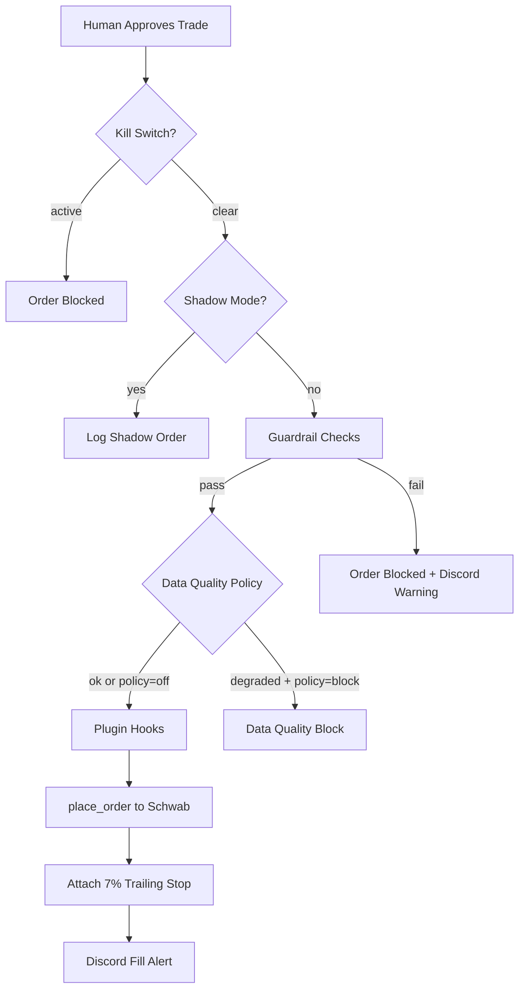

# Execution Engine

The execution engine places orders through the Schwab API with a comprehensive guardrail wrapper.

## Order Flow

## Guardrail Checks
Applied by the guardrail wrapper before every order:
- **Max account value**: `MAX_TOTAL_ACCOUNT_VALUE` (default $500k)
- **Per-ticker cap**: `MAX_POSITION_PER_TICKER` (default $50k)
- **Daily trade limit**: `MAX_TRADES_PER_DAY` (default 20)
- **Sector exposure**: `MAX_SECTOR_ACCOUNT_FRACTION` (0 = disabled)
- See [[Guardrails]] for full details

## Shadow Mode
- `EXECUTION_SHADOW_MODE=1` or `PAPER_TRADING_ENABLED=1`
- Computes all decisions but does not submit to broker
- Logs shadow events in `execution_safety_metrics.json`

## Kill Switches
- `LIVE_TRADING_KILL_SWITCH` — platform-wide halt
- `USER_TRADING_HALTED` — per-user pause (SaaS)
- `LIVE_TRADING_KILL_SWITCH_BLOCKS_EXITS` — when true, even SELL orders are blocked (default: false, exits allowed)

## Plugin Hooks
When enabled in `live` mode, these modify execution behavior:
- **Execution Quality** (`EXEC_QUALITY_MODE`) — spread/slippage checks, limit orders for liquid symbols
- **Event Risk** (`EVENT_RISK_MODE`) — block or downsize near earnings/macro events
- **Regime v2** (`REGIME_V2_MODE`) — score-based entry gate and position sizing multipliers
- **Exit Manager** (`EXIT_MANAGER_MODE`) — partial take-profit, breakeven stops, time stops
- **Correlation Guard** (`CORRELATION_GUARD_MODE`) — pair correlation limits
See [[Plugin Modes]] for details.

## Key Functions
- `place_order(ticker, qty, side, order_type, ...)` — main entry point
- `get_account_status(auth, skill_dir)` — retrieve balances and positions
- `get_position_size_usd(ticker, price, skill_dir)` — compute position size

## Key File
`schwab_skill/execution.py`

## Related
- [[Guardrails]], [[Plugin Modes]], [[Schwab Auth]]
- [[WebApp Dashboard]] — approve/reject workflow triggers execution
