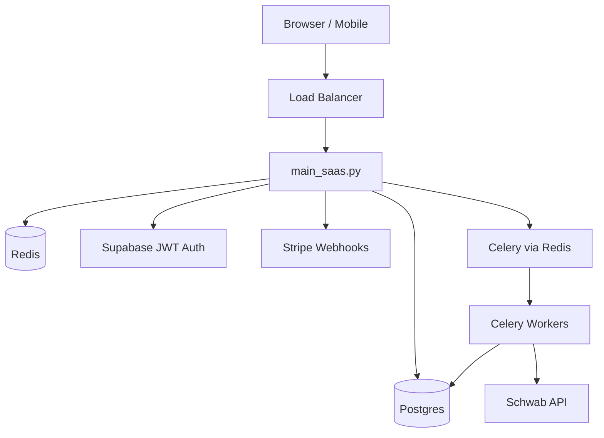

# SaaS API

Multi-tenant production API built on FastAPI with Supabase auth, Stripe billing, Celery workers, and Postgres.

## Architecture



## Key Differences from Local Dashboard
- **Authentication**: Supabase JWT instead of optional API key
- **Database**: Postgres with connection pooling instead of SQLite
- **Async work**: Celery workers with separate queues (`scan`, `orders`, `celery`)
- **Per-user tokens**: Encrypted Schwab credentials per tenant (not shared token files)
- **Billing**: Stripe subscription management
- **Rate limiting**: Redis-backed scan cooldown
- **Audit**: Database-persisted audit logs with `X-Request-ID`
- **Live execution**: Gated behind explicit `enable-live-trading` endpoint

## Live Execution Safety
- New users default to `live_execution_enabled=false`
- Must call `POST /api/settings/enable-live-trading` with risk checkbox + typing "ENABLE"
- Both account AND market Schwab tokens must be materialized
- `POST /api/orders/execute` returns **410** — must use pending trade + approve flow

## Run

API:
```
uvicorn webapp.main_saas:app --host 0.0.0.0 --port 8000
```

Workers:
```
celery -A webapp.tasks worker -Q scan,orders,celery --loglevel=info
```

Migrations:
```
alembic upgrade head
```

## Key Files
- `schwab_skill/webapp/main_saas.py` — API entry point
- `schwab_skill/webapp/tenant_dashboard.py` — per-tenant router
- `schwab_skill/webapp/security.py` — JWT validation
- `schwab_skill/webapp/tasks.py` — Celery task definitions
- `schwab_skill/docker-compose.saas.yml` — Docker Compose stack
- `schwab_skill/Dockerfile.saas` — container build
- `render.yaml` — Render Blueprint deployment

## Related
- [[SaaS Endpoints]] — full API reference
- [[Tenant Dashboard Endpoints]] — per-tenant routes
- [[SaaS Infrastructure]] — env var reference
- [[Deployment]] — deployment runbook
- See `schwab_skill/docs/SAAS_DEPLOYMENT.md` for full deployment guide
