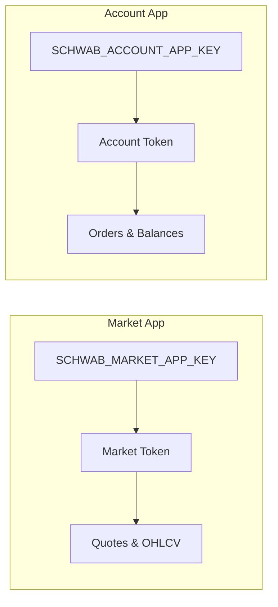

# Schwab Auth

The system uses **two separate Schwab Developer API OAuth2 app registrations** to isolate market data access from account/trading access.

## Dual Session Design

| Session | Used By | Token File |
|---------|---------|------------|
| Market | `market_data.py` — quotes, history | `tokens_market.enc` |
| Account | `execution.py` — orders, positions | `tokens_account.enc` |

## Key Class: `DualSchwabAuth`

Defined in `schwab_auth.py`. Provides:
- `get_market_token()` — returns the market session access token
- `get_account_token()` — returns the account session access token
- Automatic token refresh on expiry
- Reads encrypted token payloads from disk

## Initial Setup

1. Register two apps at the Schwab Developer Portal
2. Set env vars: `SCHWAB_MARKET_APP_KEY`, `SCHWAB_MARKET_APP_SECRET`, `SCHWAB_ACCOUNT_APP_KEY`, `SCHWAB_ACCOUNT_APP_SECRET`
3. Set `SCHWAB_CALLBACK_URL=https://127.0.0.1:8182`
4. Run `python run_dual_auth.py` — completes browser-based OAuth for both sessions

## SaaS Mode

In multi-tenant mode, each user's Schwab tokens are stored encrypted in the `user_credentials` table:
- `market_token_payload_enc` — encrypted market OAuth JSON
- `account_token_payload_enc` — encrypted account OAuth JSON
- Encryption key: `CREDENTIAL_ENCRYPTION_KEY` env var

Browser OAuth flow available via [[Tenant Dashboard Endpoints]]:
- `GET /api/oauth/schwab/account/authorize-url`
- `GET /api/oauth/schwab/account/callback`
- Same pattern for market app

## Related
- [[Schwab API Keys]] — env var reference
- [[Schwab OAuth Setup]] — runbook
- [[Execution Engine]] — uses account session
- [[Signal Scanner]] — uses market session
