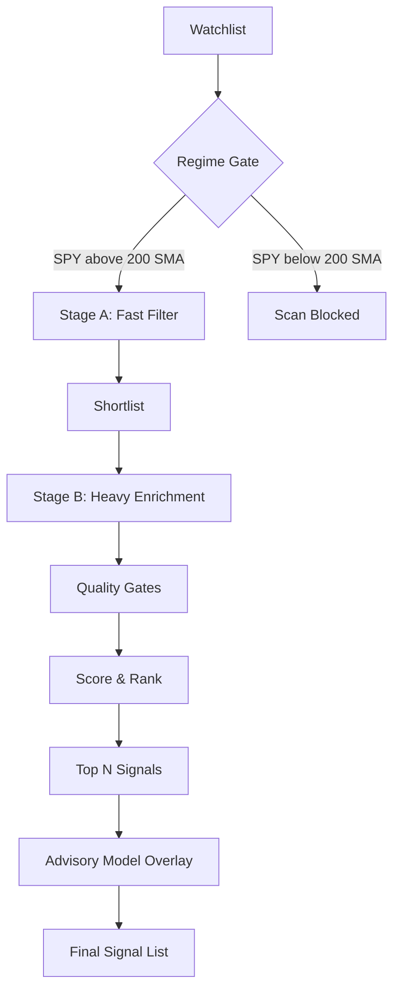

# Signal Scanner

The scanner pipeline identifies actionable trading setups from a watchlist using a two-stage funnel.

## Pipeline Architecture

## Stage A: Fast Filter
- Runs with bounded parallelism (`SCAN_STAGE_A_MAX_WORKERS`, default 4)
- Checks [[Stage 2 Analysis]] and [[VCP Detection]] criteria
- Produces a shortlist: `SIGNAL_TOP_N * SCAN_STAGE_A_SHORTLIST_MULTIPLIER` (default 3x), capped at `SCAN_STAGE_A_SHORTLIST_CAP` (default 40)
- Per-ticker timeout: `SCAN_STAGE_TASK_TIMEOUT_SEC` (default 120s)

## Stage B: Heavy Enrichment
- Runs on shortlisted tickers only (`SCAN_STAGE_B_MAX_WORKERS`, default 4)
- Fetches detailed market data, SEC filings, sector data
- Computes full signal scores with all features
- Applies [[Sector Strength]] filter if `SECTOR_FILTER_ENABLED=true`

## Quality Gates
- Mode: `QUALITY_GATES_MODE` — `off`, `shadow`, `soft` (default), `hard`
- `soft` mode: filters only when multiple weak reasons exist (`QUALITY_SOFT_MIN_REASONS`, default 2)
- `hard` mode: filters on any single weak reason
- `weak_breakout_volume` is always a hard gate regardless of mode

## Signal Scoring
- Composite score from Stage 2 proximity, VCP quality, sector strength, and enrichment features
- [[PEAD]] boost/penalty for recent earnings surprises
- Guidance tone scoring (`GUIDANCE_SCORE_ENABLED`)
- [[Forensic Accounting]] flags (Sloan, Beneish, Altman)
- SEC score hints (when `SEC_SCORE_HINT_ENABLED=true`)

## Diagnostics
Every scan produces a diagnostics dict tracking:
- `watchlist_size`, `stage2_fail`, `vcp_fail`, `exceptions`, `df_empty`
- `data_quality` and `data_quality_reasons`
- `scan_blocked` and `scan_blocked_reason` (e.g., bear regime)

## Key Functions
- `scan_for_signals()` — returns list of signal dicts
- `scan_for_signals_detailed()` — returns (signals, diagnostics) tuple
- `run_scan_and_notify()` — scan + Discord notification

## Key File
`schwab_skill/signal_scanner.py`

## Related
- [[Stage 2 Analysis]], [[VCP Detection]], [[Sector Strength]]
- [[Signal Ranking]], [[Advisory Model]]
- [[Scanner Tunables]] — all scanner env vars
- [[Quality Gates]]
