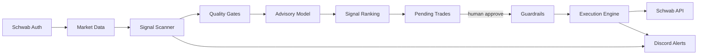
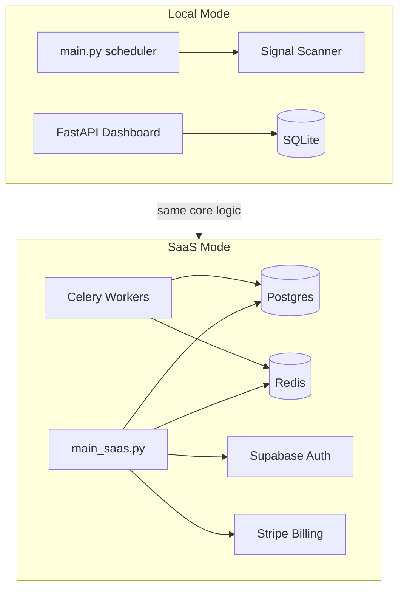

# System Overview

The TradingBot is a Schwab-oriented trading assistant that scans for technical setups, applies risk guardrails, and executes trades with human approval.

## End-to-End Pipeline

## Deployment Topology

## Key Files

| File | Role |
|------|------|
| `schwab_auth.py` | [[Schwab Auth]] — dual OAuth sessions |
| `market_data.py` | OHLCV history and real-time quotes |
| `stage_analysis.py` | [[Stage 2 Analysis]] and [[VCP Detection]] |
| `signal_scanner.py` | [[Signal Scanner]] — two-stage pipeline |
| `execution.py` | [[Execution Engine]] with [[Guardrails]] |
| `guardrail.py` | Risk limit checks |
| `advisory_model.py` | [[Advisory Model]] — P(up) scoring |
| `full_report.py` | Multi-section ticker research report |
| `notifier.py` | [[Discord Integration]] — webhook alerts |
| `main.py` | Scheduler: heartbeat, scans, self-study |
| `TradingSkill.py` | OpenClaw @tool interface |
| `webapp/main.py` | [[WebApp Dashboard]] |
| `webapp/main_saas.py` | [[SaaS API]] |
| `config.py` | All tunables (see [[Config Reference MOC]]) |

## Related
- [[Architecture MOC]]
- [[Trading Strategy MOC]]
