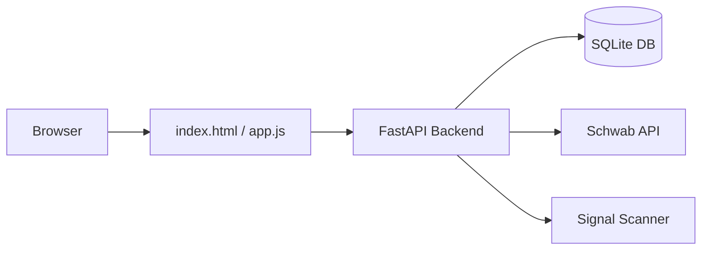

# WebApp Dashboard

FastAPI-powered local web dashboard for scanning, trade management, and portfolio monitoring.

## Architecture



## Workflow
The dashboard UI is organized around **today's workflow**:

1. **Health check** — token health, quote probe, blockers
2. **Run scan** — async scan with real-time status polling
3. **Review signals** — signal cards with scores, advisory confidence, event risk
4. **Queue trades** — create pending trades from signals or manual entry
5. **Approve/reject** — pre-trade checklist, typed ticker confirmation, live execution
6. **Portfolio** — current positions with P&L
7. **Sectors** — sector heatmap relative to SPY
8. **Quick check** — instant ticker technical analysis
9. **Full report** — multi-section research (technical, DCF, health, SEC, MiroFish)

## UI Modes
- **Simple / Standard / Pro** — saved in `localStorage`, controls panel visibility
- **Expert mode** — server-backed setting on `/api/settings/profile`, exposes runtime overrides

## Settings Profiles
Preset profiles (`balanced`, etc.) apply a bundle of config overrides:
- `POST /api/settings/profile` — switch profile, set mode, opt into automation

## Onboarding
Guided 4-step onboarding targeting 20-minute completion:
1. Connect (check token files exist)
2. Verify token health (market + account + quote probe)
3. Test scan (run full scan, check for errors)
4. Test paper order (shadow mode AAPL buy)

## Key Files
- `schwab_skill/webapp/main.py` — FastAPI app and all route handlers
- `schwab_skill/webapp/static/index.html` — main dashboard HTML
- `schwab_skill/webapp/static/app.js` — frontend JavaScript
- `schwab_skill/webapp/db.py` — SQLAlchemy engine and session
- `schwab_skill/webapp/models.py` — database tables

## Run
```
uvicorn webapp.main:app --reload --port 8000
```
Open: `http://127.0.0.1:8000`

## Related
- [[Local Dashboard Endpoints]] — full API reference
- [[Database Schema]] — all tables
- [[SaaS API]] — production multi-tenant version
